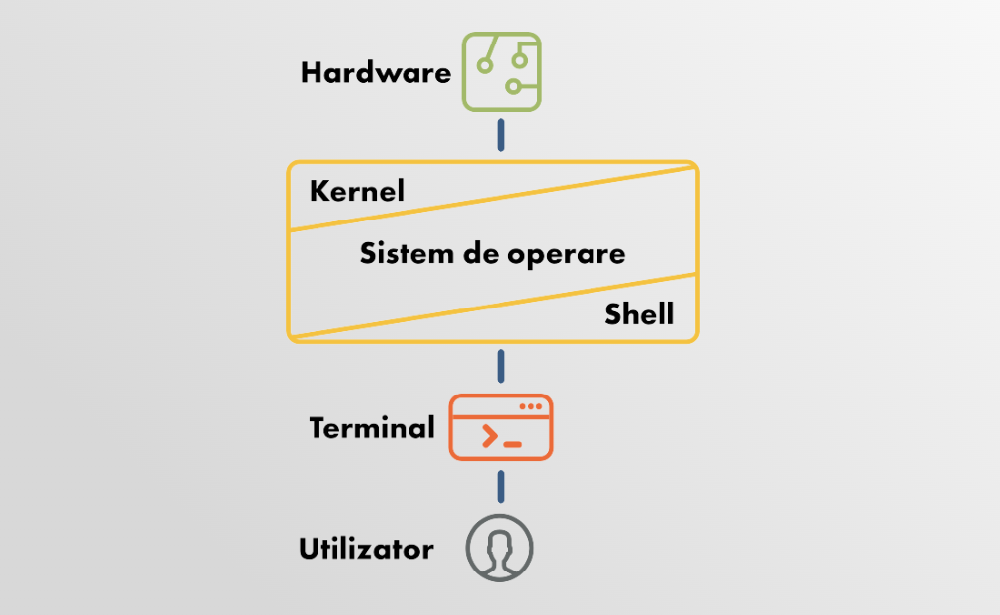
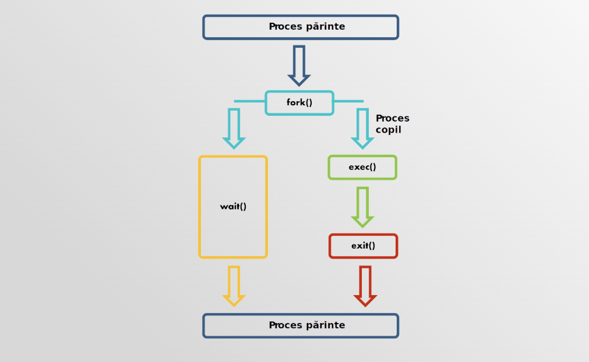

Through this project I learned fundamental concepts about processes, Unix system calls and shells.  

# Simple Shell in C

A shell has **3 main responsabilities** during its lifetime: 
1. **Initialize** - reading and executing its configuration files
2. **Interpret** - read commands from stdin
3. **Terminate** - after executing commands, stopping   

Its "power" comes from executing the commands it receives. To execute a command, the shell needs to create one or more processes. The shell itself is also a process.

### How do Unix-like systems create a new process ?   
- A process creates a copy of itself using the `fork()` function. After the fork, there are two processes: the parent and the child. The child process can then be modified to perform new actions or execute a different program.    

### How do we distinguish the parent and the child ?  
- Every process has a PID (process id) and a PPID (parent process id). The child will have a new PID and a PPID equals to his parent PID. 

### How is the child process modified ?     
- The `exec()` family of functions replaces the child's memory image with a new program, effectively transforming the child into the command to execute.

### What happens with the parent process while the child runs ?     
- The parent usually waits.     

**I used Unix system calls such as `fork()`, `exec()` and `wait()` to make my shell interact with the real filesystem.**    
**In this implementation, I assumed that commands and their arguments are separated by whitespace**    

### Running:
    gcc main.c -o main
    ./main

<small>My main source for learning these concepts was [Writing a Shell in C](https://brennan.io/2015/01/16/write-a-shell-in-c/).</small>
